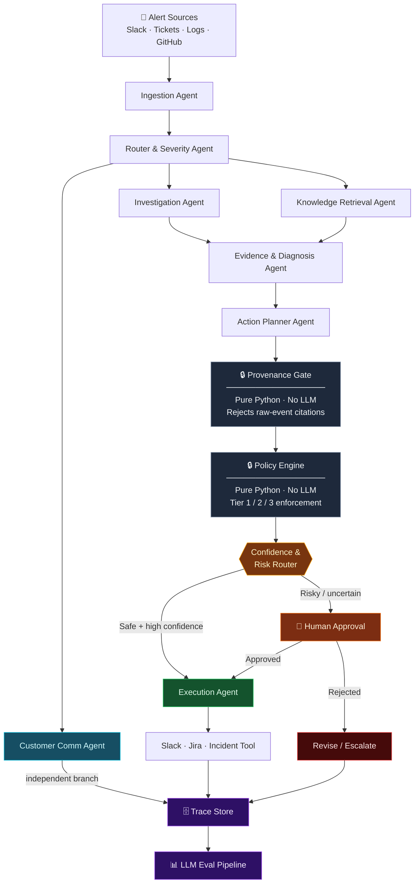

<div align="center">

# OpsPilot

**Agentic AI incident response — from raw alert to executed remediation, safely.**

[](https://python.org)
[](https://github.com/langchain-ai/langgraph)
[](https://docs.pydantic.dev)
[](./tests/)
[](https://github.com/astral-sh/ruff)

</div>

---

OpsPilot is a **multi-agent incident-response system** built on LangGraph. It ingests alerts from Slack (and can extend to tickets, logs, GitHub Issues) — investigates them in parallel across specialised agents — then routes remediation actions through two deterministic safety gates before anything is executed.

Narrative enrichment uses **Groq’s free tier** when `GROQ_API_KEY` is set; without a key the system stays fully offline on heuristics. Remediations use **simulated tools** by default so you can run at **$0**.

No LLM decides what gets executed. That decision belongs to pure-Python logic that can be audited, unit-tested, and trusted.

---

## How It Works



---

## The Safety Gates

OpsPilot enforces two deterministic gates between planning and execution — both are pure Python with zero model calls.

### Provenance Gate
Every `ActionProposal` must cite evidence by `tool_output_id`. If a reference cannot be resolved to a real `ToolOutput` collected during investigation, the proposal is **rejected before the Policy Engine sees it**. Raw event content is never valid evidence.

### Policy Engine — Tier Classification

| Tier | Type | Examples | Decision |
|:----:|------|----------|----------|
| **1** | `read_only` | Fetch logs, read metrics, describe config | Auto-approved |
| **2** | `reversible_write` | Restart service, toggle flag, flush cache | Auto / light review |
| **3** | `high_risk_write` | DB migration, infra teardown, secret rotation | Mandatory human approval |

The routing decision (auto-execute vs. human-in-the-loop) is made **strictly after both gates pass** — never before.

---

## Project Layout

```
opspilot/
├── schemas.py                  # All Pydantic v2 contracts — every data boundary
├── provenance_gate.py          # Deterministic Provenance Gate
├── policy_engine.py            # Deterministic Policy Engine
├── config.py                   # Env-driven settings (offline defaults)
├── llm.py                      # Groq narrative enrichment + guardrails hook
├── guardrails.py               # Deterministic (+ optional Groq) text guardrails
├── confidence_router.py        # Deterministic Confidence & Risk Router
├── trace_store.py              # JSONL incident trace persistence
├── eval_harness.py             # Offline scenario evaluation suite
├── cli.py                      # `opspilot run` / `opspilot eval`
├── graph.py                    # LangGraph pipeline + human-in-the-loop
├── server.py                   # Unified ingest + HITL web UI
├── checkpoint.py               # SQLite / memory LangGraph checkpointer
├── approval_queue.py           # Durable pending-approval JSON queue
├── approvals_ui.py             # /approvals web UI + /api/approvals
├── integrations/
│   ├── slack/                  # Bolt + FastAPI Slack adapter
│   ├── jira/                   # Jira issue/comment webhook adapter
│   ├── github/                 # GitHub Issues webhook adapter
│   ├── tickets/                # Support-ticket webhook adapter
│   ├── logs/                   # Logs / Alertmanager webhook adapter
│   └── signing.py              # Webhook HMAC / shared-secret checks
├── tools/
│   ├── simulated.py            # Simulated tool registry ($0)
│   └── executor.py             # Remediation modes + override hooks
└── agents/
    ├── ingestion.py
    ├── router.py
    ├── investigation.py
    ├── knowledge_retrieval.py
    ├── customer_communication.py
    ├── evidence_diagnosis.py
    ├── action_planner.py
    └── execution.py

tests/
├── test_provenance_gate.py
├── test_policy_engine.py
├── test_confidence_router.py
├── test_agents.py
├── test_graph.py
├── test_hitl.py
├── test_eval_harness.py
└── test_slack_adapter.py
```

---

## Build Status

| Module | Status |
|--------|--------|
| Schemas | ✅ Complete |
| Provenance Gate | ✅ Complete |
| Policy Engine | ✅ Complete |
| Simulated Tools | ✅ Complete |
| Agents (8) | ✅ Heuristic / offline (+ optional LLM prose) |
| Confidence Router | ✅ Complete |
| LangGraph Pipeline | ✅ Complete |
| Human approval loop | ✅ Interrupt / resume (CLI + API) |
| Trace Store | ✅ JSONL |
| Eval Harness | ✅ Offline scenarios |
| CLI | ✅ `opspilot run` / `opspilot eval` |
| Slack adapter (Bolt + FastAPI) | ✅ Events, enrichment, HITL buttons |
| Jira / GitHub webhook adapters | ✅ Issue/comment ingest + signature checks |
| Support tickets / logs adapters | ✅ Generic ticket + Alertmanager-style ingest |
| Unified ingest server | ✅ `opspilot.server:app` (one tunnel) |
| Durable HITL | ✅ SQLite checkpointer + JSON approval queue |
| Web approval UI | ✅ `/approvals` + `/api/approvals` |
| Groq enrichment + guardrails | ✅ Free-tier compatible |
| LLM tool / action planning | ✅ Groq planner with heuristic fallback |
| Remediation executor | ✅ Simulated / dry-run ($0); overrides for real cloud |
| Free go-live guide | ✅ `docs/FREE_SLACK_GROQ.md` |
| Real cloud remediations | ✅ Out of scope for $0 — use `register_tool_override` |

---

## Quickstart

```bash
git clone https://github.com/ARYANRAJ1121/OpsPilot.git
cd OpsPilot

pip install -e ".[dev]"

cp .env.example .env   # optional — works fully offline without keys

# Run the test suite
py -3.11 -m pytest tests/ -v

# Check free Slack + Groq config
opspilot doctor

# Local Slack adapter smoke (no Slack network)
opspilot smoke-slack

# Run a simulated incident (auto-executes when safe)
opspilot run "ALERT: api-service error rate 18% — p99 latency 4200ms"

# Force human-approval path, then auto-approve
set OPSPILOT_CONFIDENCE_THRESHOLD=0.99
opspilot run --approve "ALERT: api-service error rate 18%"

# Offline eval harness
opspilot eval

# Unified free ingest (Slack + Jira + GitHub) — docs/FREE_SLACK_GROQ.md
uvicorn opspilot.server:app --host 0.0.0.0 --port 8000
# then: cloudflared tunnel --url http://127.0.0.1:8000
```

Point Slack at `/slack/events` and `/slack/interactions`, Jira at `/jira/webhook`,
GitHub at `/github/webhook`, tickets at `/tickets/webhook`, logs at `/logs/webhook`.
Open **http://127.0.0.1:8000/approvals** for the web HITL queue.

**Free setup guide:** [docs/FREE_SLACK_GROQ.md](./docs/FREE_SLACK_GROQ.md)

---

## Stack

[LangGraph](https://github.com/langchain-ai/langgraph) · [LangChain](https://github.com/langchain-ai/langchain) · [Groq](https://console.groq.com) (free tier) · [Pydantic v2](https://docs.pydantic.dev) · [slack-bolt](https://slack.dev/bolt-python/) · [FastAPI](https://fastapi.tiangolo.com/) · [structlog](https://www.structlog.org) · [ruff](https://github.com/astral-sh/ruff) · [mypy strict](https://mypy-lang.org) · Python 3.11+
