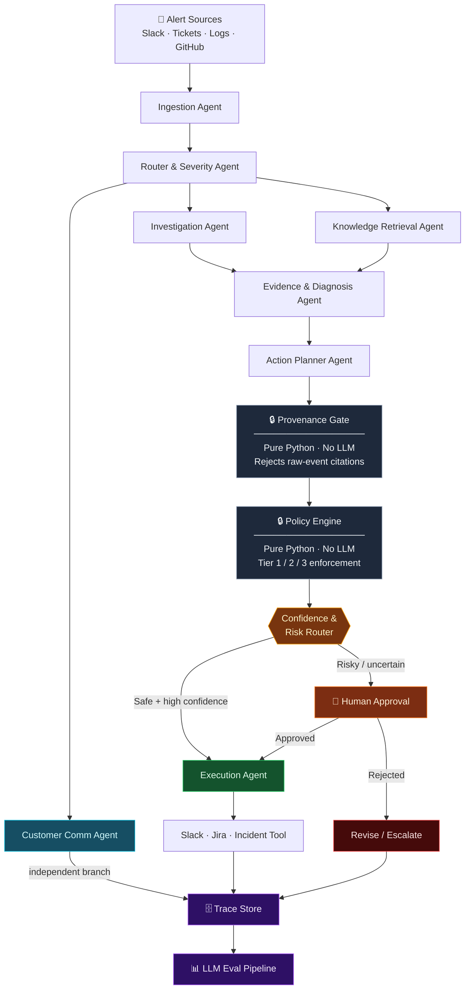

<div align="center">

# OpsPilot

**Agentic AI incident response — from raw alert to executed remediation, safely.**

[](https://python.org)
[](https://github.com/langchain-ai/langgraph)
[](https://docs.pydantic.dev)
[](./tests/)
[](https://github.com/astral-sh/ruff)

</div>

---

OpsPilot is a **multi-agent incident-response system** built on LangGraph. It ingests alerts from Slack, support tickets, logs, and GitHub Issues — investigates them in parallel across specialised agents — then routes remediation actions through two deterministic safety gates before anything is executed.

No LLM decides what gets executed. That decision belongs to pure-Python logic that can be audited, unit-tested, and trusted.

---

## How It Works



---

## The Safety Gates

OpsPilot enforces two deterministic gates between planning and execution — both are pure Python with zero model calls.

### Provenance Gate
Every `ActionProposal` must cite evidence by `tool_output_id`. If a reference cannot be resolved to a real `ToolOutput` collected during investigation, the proposal is **rejected before the Policy Engine sees it**. Raw event content is never valid evidence.

### Policy Engine — Tier Classification

| Tier | Type | Examples | Decision |
|:----:|------|----------|----------|
| **1** | `read_only` | Fetch logs, read metrics, describe config | Auto-approved |
| **2** | `reversible_write` | Restart service, toggle flag, flush cache | Auto / light review |
| **3** | `high_risk_write` | DB migration, infra teardown, secret rotation | Mandatory human approval |

The routing decision (auto-execute vs. human-in-the-loop) is made **strictly after both gates pass** — never before.

---

## Project Layout

```
opspilot/
├── schemas.py                  # All Pydantic v2 contracts — every data boundary
├── provenance_gate.py          # Deterministic Provenance Gate
├── policy_engine.py            # Deterministic Policy Engine            ← next
├── tools/
│   └── simulated.py            # Simulated tool registry
├── agents/
│   ├── ingestion.py
│   ├── router.py
│   ├── investigation.py
│   ├── knowledge_retrieval.py
│   ├── customer_communication.py
│   ├── evidence_diagnosis.py
│   ├── action_planner.py
│   └── execution.py
└── graph.py                    # LangGraph graph definition

tests/
├── test_provenance_gate.py     # 11/11 passing
└── test_policy_engine.py       ← next
```

---

## Build Status

| Module | Status |
|--------|--------|
| Schemas | ✅ Complete |
| Provenance Gate | ✅ Complete · 11/11 tests passing |
| Policy Engine | 🔧 In progress |
| Simulated Tools | ⬜ Pending |
| LangGraph Skeleton | ⬜ Pending |
| Agents (7) | ⬜ Pending |
| Eval Harness | ⬜ Pending |

---

## Quickstart

```bash
git clone https://github.com/ARYANRAJ1121/OpsPilot.git
cd OpsPilot

pip install -e ".[dev]"

cp .env.example .env   # add your LLM API key

py -3.11 -m pytest tests/ -v
```

---

## Stack

[LangGraph](https://github.com/langchain-ai/langgraph) · [LangChain](https://github.com/langchain-ai/langchain) · [Pydantic v2](https://docs.pydantic.dev) · [structlog](https://www.structlog.org) · [ruff](https://github.com/astral-sh/ruff) · [mypy strict](https://mypy-lang.org) · Python 3.11+
