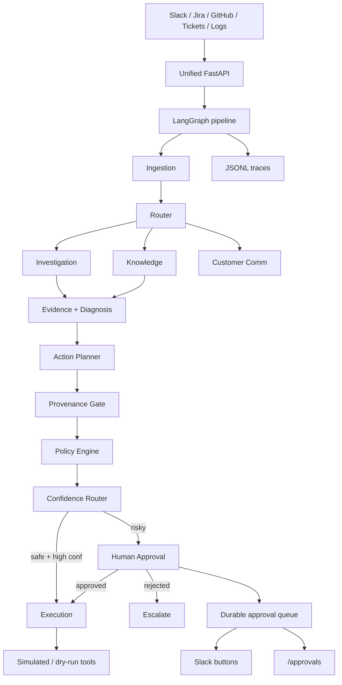

<div align="center">

# OpsPilot

**Agentic incident response — alert in, gated remediation out.**

[](https://github.com/ARYANRAJ1121/OpsPilot/actions/workflows/ci.yml)
[](https://python.org)
[](https://github.com/langchain-ai/langgraph)
[](./CHANGELOG.md)
[](./LICENSE)

Ingest from Slack · Investigate with specialised agents · Execute only after deterministic safety gates

</div>

---

## Why OpsPilot

Most “AI ops” demos let a model decide what to run in production. OpsPilot does the opposite:

| Layer | Role |
|-------|------|
| **LLM (optional Groq)** | Narrative enrichment + tool/action *suggestions* |
| **Pure Python gates** | Provenance, policy tiers, confidence routing — **what may execute** |
| **HITL** | Interrupt / resume via Slack buttons, web UI, or CLI |
| **$0 by default** | Simulated / dry-run remediations; no cloud bill required |

**Live path proven:** Slack message → triage → `auto_execute` (e.g. simulated `restart_service`) with confidence scoring.

---

## How it works



### Safety gates (no LLM)

1. **Provenance** — every action must cite real `tool_output_id`s from this incident (never raw alert text).
2. **Policy** — tools classified Tier 1 / 2 / 3; high-risk writes always need a human.
3. **Confidence** — score vs `OPSPILOT_CONFIDENCE_THRESHOLD` → auto-execute, HITL, or escalate.

---

## Features

- **8 agents** — ingestion, router, investigation, knowledge, customer comms, diagnosis, planner, execution  
- **Ingest** — Slack Events + Interactivity, Jira, GitHub Issues, support tickets, logs/Alertmanager  
- **Groq** — free-tier enrichment + optional LLM planning (heuristic fallback always available)  
- **Guardrails** — deterministic checks (+ optional Groq judge)  
- **Durable HITL** — SQLite LangGraph checkpoints + JSON approval queue (survives restart)  
- **Approvals UI** — `/approvals` and `/api/approvals` (token-protectable)  
- **CLI** — `run`, `eval`, `doctor`, `smoke-slack`, `smoke-webhooks`  
- **Offline-first** — full pipeline without any API keys  

---

## Quickstart

```bash
git clone https://github.com/ARYANRAJ1121/OpsPilot.git
cd OpsPilot
pip install -e ".[dev]"
cp .env.example .env          # optional — works offline with empty keys

pytest tests/ -q
opspilot doctor
opspilot run "ALERT: api-service error rate 18% — p99 latency 4200ms"
```

Force the human-approval path:

```bash
# Windows PowerShell
$env:OPSPILOT_CONFIDENCE_THRESHOLD="0.99"
opspilot run --approve "ALERT: api-service error rate 18%"
```

### Live Slack ($0)

```bash
# Terminal 1
uvicorn opspilot.server:app --host 0.0.0.0 --port 8000

# Terminal 2 — free public URL
cloudflared tunnel --url http://127.0.0.1:8000
```

Point Slack **Event Subscriptions** at `/slack/events` and **Interactivity** at `/slack/interactions` on the tunnel host. Invite the bot, then post:

```text
incident: api-service error rate 18%
```

Full walkthrough: **[docs/FREE_SLACK_GROQ.md](./docs/FREE_SLACK_GROQ.md)**

---

## CLI reference

| Command | Purpose |
|---------|---------|
| `opspilot run "ALERT: …"` | Run one incident end-to-end |
| `opspilot run --approve / --reject` | Auto-decide when HITL pauses |
| `opspilot eval` | Offline scenario harness |
| `opspilot doctor` | Print config / readiness tips |
| `opspilot smoke-slack` | Local Slack adapter smoke (no network) |
| `opspilot smoke-webhooks` | Jira/GitHub/tickets/logs adapter smoke |

Useful Make targets: `make test` · `make lint` · `make serve` · `make doctor`

---

## HTTP surface

| Method | Path | Notes |
|--------|------|-------|
| GET | `/healthz` | Liveness + integration flags |
| GET | `/approvals` | Web HITL queue (`?token=` if configured) |
| GET/POST | `/api/approvals…` | JSON list + decide |
| POST | `/slack/events` | Slack Events API |
| POST | `/slack/interactions` | Approve / Reject / context |
| POST | `/jira/webhook` · `/github/webhook` · `/tickets/webhook` · `/logs/webhook` | Signed ingest |

OpenAPI: `http://127.0.0.1:8000/docs` while the server is running. Details: **[docs/API.md](./docs/API.md)**

---

## Configuration (highlights)

Copy [`.env.example`](./.env.example) → `.env`:

| Variable | Purpose |
|----------|---------|
| `GROQ_API_KEY` | Free narrative enrichment / planning |
| `SLACK_BOT_TOKEN` / `SLACK_SIGNING_SECRET` | Live Slack |
| `OPSPILOT_APPROVAL_API_TOKEN` | Lock `/approvals` before public tunnels |
| `OPSPILOT_WEBHOOK_REQUIRE_SIGNATURES` | Reject unsigned webhooks (default `true`) |
| `OPSPILOT_REMEDIATION_MODE` | `simulated` or `dry_run` |
| `OPSPILOT_SLACK_SKIP_REQUEST_VERIFICATION` | Local tunnel only if signature mismatch |

Real cloud actions: implement a tool and call `register_tool_override("restart_service", fn)` — see `opspilot/tools/executor.py`.

---

## Project layout

```
opspilot/
├── schemas.py                 # Pydantic v2 contracts
├── provenance_gate.py         # Evidence must resolve to ToolOutputs
├── policy_engine.py           # Tier 1 / 2 / 3
├── confidence_router.py       # Auto vs HITL vs escalate
├── graph.py                   # LangGraph + interrupt/resume
├── checkpoint.py              # SQLite / memory checkpointer
├── approval_queue.py          # Durable pending approvals
├── approvals_ui.py            # Web + API approvals
├── server.py                  # Unified ingest FastAPI app
├── cli.py                     # opspilot entrypoint
├── llm.py / llm_planner.py    # Groq enrichment + planning
├── guardrails.py              # Input/output checks
├── agents/                    # Eight specialised agents
├── tools/                     # Simulated registry + executor
└── integrations/              # slack, jira, github, tickets, logs, signing
tests/                         # Unit + integration + adversarial suites
docs/                          # Architecture, API, go-live, contributing
```

Architecture deep-dive: **[docs/ARCHITECTURE.md](./docs/ARCHITECTURE.md)** · Contributing: **[docs/CONTRIBUTING.md](./docs/CONTRIBUTING.md)** · Changelog: **[CHANGELOG.md](./CHANGELOG.md)**

---

## Status

| Area | State |
|------|--------|
| Core pipeline + safety gates | Done |
| Slack live ingest + HITL buttons | Done (verified end-to-end) |
| Jira / GitHub / tickets / logs adapters | Done |
| Durable HITL + `/approvals` | Done |
| Groq enrichment / planning + guardrails | Done |
| Simulated / dry-run remediations | Done ($0) |
| CI, MIT license, Docker, Makefile | Done |
| Paid cloud remediations (AWS/K8s) | Out of scope — `register_tool_override` |

---

## Stack

[LangGraph](https://github.com/langchain-ai/langgraph) · [LangChain](https://github.com/langchain-ai/langchain) · [Groq](https://console.groq.com) · [Pydantic v2](https://docs.pydantic.dev) · [FastAPI](https://fastapi.tiangolo.com/) · [slack-bolt](https://slack.dev/bolt-python/) · [structlog](https://www.structlog.org) · Python 3.11+

---

<div align="center">

MIT License · Built for safe agentic ops demos without a cloud bill

</div>
