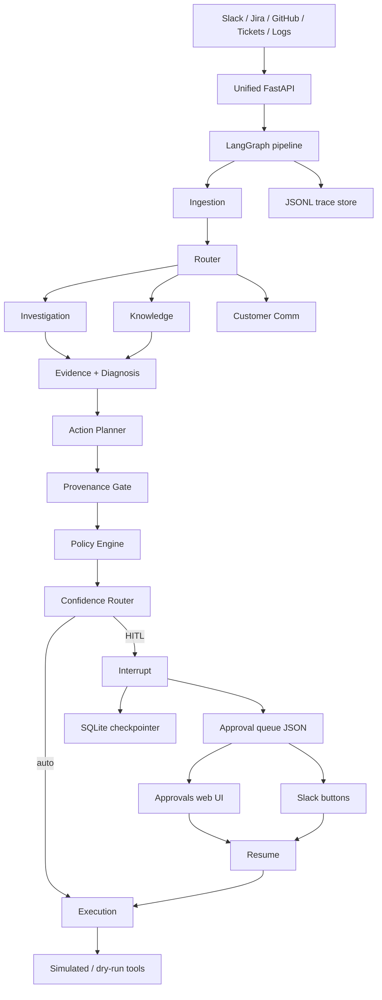

# Architecture

OpsPilot is a LangGraph multi-agent incident-response pipeline with deterministic safety gates.

## Safety model

1. **Provenance Gate** — proposals must cite real tool outputs (never raw alert text).
2. **Policy Engine** — tiers 1/2/3; tier-3 always needs a human.
3. **Confidence Router** — score vs `OPSPILOT_CONFIDENCE_THRESHOLD`.
4. **HITL** — LangGraph interrupt + durable SQLite checkpoint + JSON approval queue.

## $0 remediations

Default `OPSPILOT_REMEDIATION_MODE=simulated` (or `dry_run`). Real cloud actions are intentionally out of scope; register overrides via `register_tool_override`.

## Process entrypoints

| Entry | Purpose |
|-------|---------|
| `opspilot run` | CLI one-shot incident |
| `opspilot eval` | Offline eval harness |
| `opspilot doctor` | Config health |
| `uvicorn opspilot.server:app` | Live ingest + `/approvals` |
